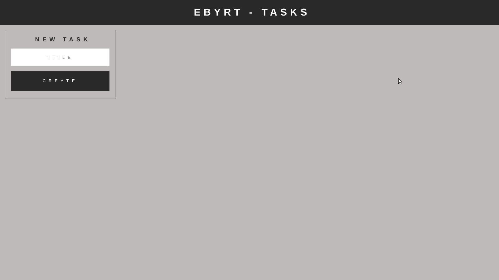
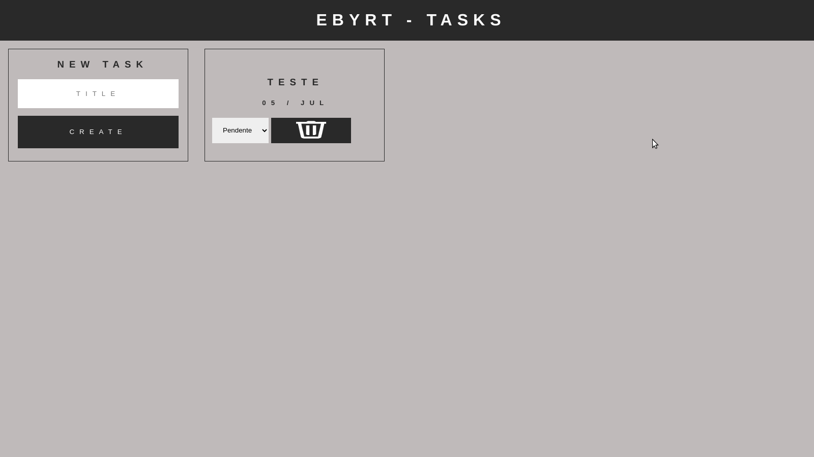
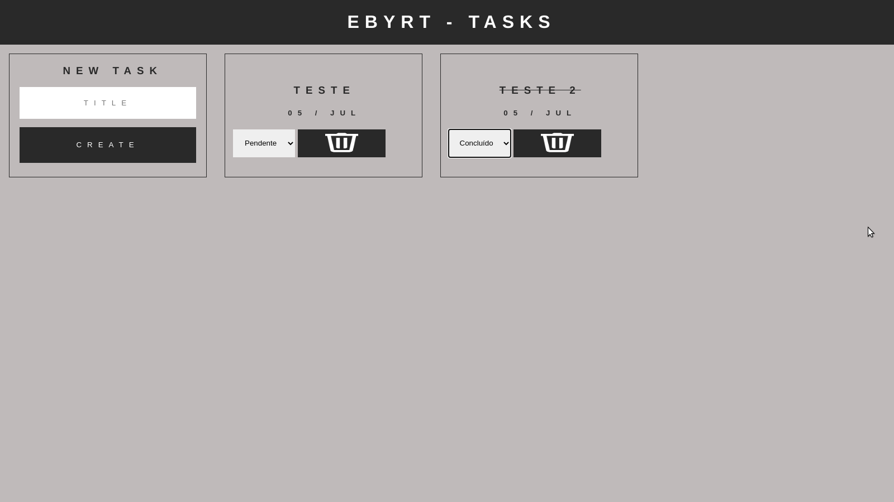

# Boas vindas ao repositório do projeto Ebyrt Task!

Este é um projeto desenvolvido durante o curso da Trybe, com o objetivo de criar uma aplicação para fazer o gerenciamento de tarefas.

## Desenvolvimento
Clone o projeto `git@github.com:mabiiak/ebyrt-task.git`

Entre na pasta do repositório que você acabou de clonar `cd ebyrt-task`

instale as dependencias `npm start`

  
 Front-end 

  
  `git checkout frontend`
  
  Para visualizar o Front-end `npm start`
  

  
 Back-end 

  
  `git checkout backend`
  
  Crie o banco de dados com a query no arquivo `Ebyrt-task.sql`
  
  Para visualizar a API `npm run dev`

## Funcionalidades
* Criar nova tarefa

  

* Listar tarefas

  

* Alterar status da tarefa

  

* Deletar tarefa

## Tecnologias utilizadas

  
 Front-end 

  
  * JavaScript
  
  * ReactJs
  
  * Styled-Components

  
 Back-end 

  
  * JavaScript
  
  * Node
  
  * Express

## Implementações futuras

Infelizmente não consegui concluir o desafio, mas pretendo fazer ainda:

* Integração do Back end com o Front

* Criar testes

* Ordenar tarefas, por nome, status ou criação

* Editar tarefa

